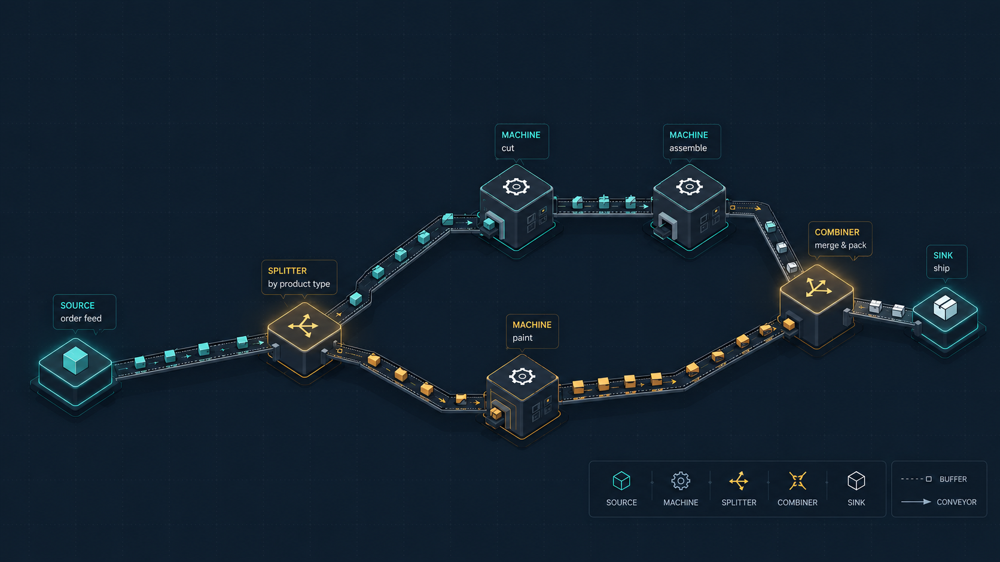

<div align="center">

# SimTrace



**A traceable, tool-building discrete-event simulation toolkit for SimPy models, exposed over MCP.**


[](LICENSE)

</div>

---

SimTrace exposes [FactorySimPy](https://github.com/FactorySimPy/FactorySimPy)
discrete-event simulation primitives as **MCP tools**, so an LLM agent can build a
factory model step by step (create nodes, create edges, wire them together, and
run the simulation), with **every tool call traced** via OpenTelemetry.

The server speaks the open [MCP](https://modelcontextprotocol.io) protocol over
stdio and is **client-agnostic**: any MCP client (a desktop assistant, an
agent framework, or a custom client) can drive it.

## Features

- 🧱 **Composable primitives:** sources, machines, splitters, combiners, buffers,
  conveyors, and fleets, each a single well-typed tool call.
- 🤖 **Agent-native:** an LLM builds the model one tool call at a time, running
  and adjusting it as it goes, rather than emitting a fixed script.
- 🔍 **Traceable by default:** every tool call becomes an OpenTelemetry span you
  can inspect in Jaeger, so you can see exactly how a model was built and run.
- ✅ **Post-run verification:** conservation and per-item flow checks catch models
  that silently lose or misroute items.

## Tools

| Group | Tools | Module |
|---|---|---|
| Nodes (active) | `create_source`, `create_sink`, `create_machine`, `create_splitter`, `create_combiner` | `simtrace.tools.builders.nodes` |
| Edges (passive) | `create_buffer`, `create_conveyor`, `create_fleet` | `simtrace.tools.builders.edges` |
| Lifecycle | `connect`, `get_model`, `reset_model`, `run_simulation` | `simtrace.tools.simulation` |
| Verification (post-run) | `verify_conservation`, `verify_item_flow` | `simtrace.tools.validation` |

Design notes live in [`architecture/`](architecture/) (`node_tools.md`,
`edge_tools.md`, `simulation_tools.md`, `observability.md`). Worked models live in
[`examples/`](examples/).

## Quick start

Requires Python 3.11+ and [uv](https://docs.astral.sh/uv/).

```bash
git clone https://github.com/s0582346/SimTrace.git
cd SimTrace
uv sync
```

This installs all dependencies, including the vendored FactorySimPy checkout
under `vendor/FactorySimPy`.

Then launch the MCP server:

```bash
uv run python -m simtrace.server
```

The server speaks MCP over stdio, so it is normally launched by an MCP client
(see below) rather than run by hand.

> **Note:** the `simtrace` console script in `pyproject.toml` is not currently
> wired up; use `python -m simtrace.server`.

## Connecting an MCP client

The server is a standard stdio MCP server. Configure your MCP client to launch
it with the project's venv Python:

```
/path/to/simtrace/.venv/bin/python -m simtrace.server
```

Replace `/path/to/simtrace` with your clone's absolute path (on Windows, e.g.
`C:\\Users\\you\\simtrace` with `\\.venv\\Scripts\\python.exe`).

Many clients share the same JSON config format, adding the server under an
`mcpServers` key:

```json
{
  "mcpServers": {
    "simtrace": {
      "command": "/path/to/simtrace/.venv/bin/python",
      "args": ["-m", "simtrace.server"]
    }
  }
}
```

Once configured, the SimTrace tools appear in the client. See your client's
documentation for where its config lives and how to reload it.

## Observability (OpenTelemetry + Jaeger)

Every tool call becomes an OpenTelemetry span, exported over OTLP/HTTP to a local
Jaeger instance.

1. Start Jaeger:

   ```bash
   docker compose up -d
   ```

2. Generate some spans without needing an MCP client. The smoke script invokes
   the real tools end to end (build a `source -> buffer -> sink` line, run it, and
   trigger one error span):

   ```bash
   uv run python scripts/trace_smoke.py
   ```

   It runs fine even if Jaeger is down (spans are just dropped), so it also
   doubles as a quick check that the tool path works.

3. View traces at <http://localhost:16686> → Service **simtrace** → *Find Traces*.

When the server is driven by an MCP client, spans are exported the same way; just
keep Jaeger running. See
[`architecture/observability.md`](architecture/observability.md) for the design
and configuration details (e.g. `OTEL_EXPORTER_OTLP_ENDPOINT`).

## License

SimTrace is released under the [MIT License](LICENSE).

## Acknowledgments

- [FactorySimPy](https://github.com/FactorySimPy/FactorySimPy), whose
  discrete-event simulation primitives SimTrace builds on.
- [Fraunhofer IPK](https://www.ipk.fraunhofer.de/), for supporting this work.
