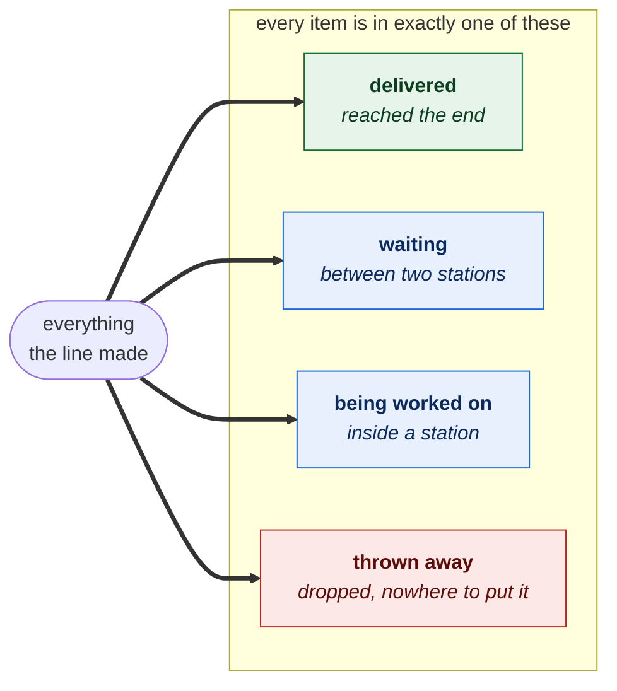
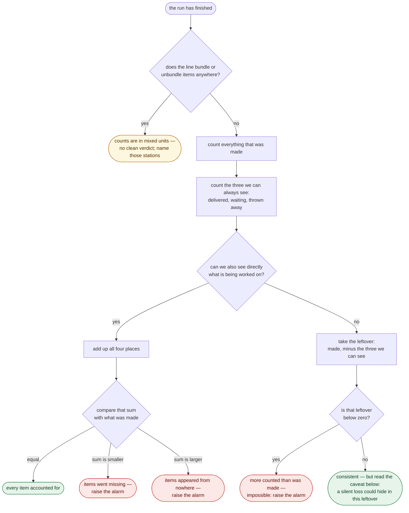

# Conservation check — nothing gets lost

Everything the line makes has to end up somewhere. When the run stops, every
item that was ever made sits in exactly one of four places:

Nothing else can happen to an item. So the amount that was made must equal the
amount spread across those four places:

> **made  =  delivered  +  waiting  +  being worked on  +  thrown away**

If the two sides match, every item is accounted for. If they don't, items went
missing or appeared from nowhere — and that is the alarm to raise.

## The check, in full

The three easy places to see are what was **delivered**, what is still **waiting**
between stations, and what was **thrown away** — each can be counted where it
sits. The subtle one is what is still **being worked on** inside a station, and
whether we can see it directly changes what the check can prove.

## The asymmetry worth knowing

Made-up items and missing items are **not** equally easy to catch.

- **Items appearing from nowhere** is always caught. It is logically impossible
  for the four places to hold more than was ever made, so if the numbers say they
  do, something is definitely wrong — no judgement call needed.

- **Items going missing** is only caught if we can see, on its own, what is being
  worked on. If we can, a shortfall in the total is a true signal of loss. If we
  **can't** — and instead call "whatever is unaccounted for" the work in progress
  — then a genuinely lost item quietly gets folded into that leftover and looks
  like normal work still on the bench. The books balance, but only because the
  missing item was silently reclassified rather than found.

So a clean pass means *consistent*, which is not quite the same as *nothing was
lost*. The stronger guarantee needs an independent count of what is on the bench,
not a leftover.

## When a simple head-count isn't enough

The whole check assumes one item in means one item out at every station. Most
stations honour that. But some deliberately change how many items there are:

- a **bundling** station takes several items and combines them into a single one,
- an **unbundling** station takes one item and separates it back into several.

Where that happens, a plain head-count can't be reconciled: the very same goods
are counted as one number before the station and a different number after it.
Rather than guess, the check declines a clean verdict and names the stations
responsible. For lines with no bundling or unbundling, it gives a definite
answer.

---

*The concept behind the `verify_conservation` check in
`src/simtrace/tools/validation.py`.*
