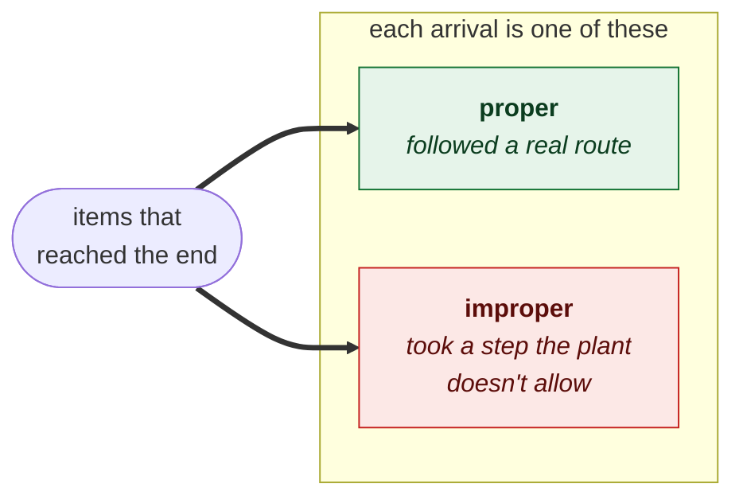
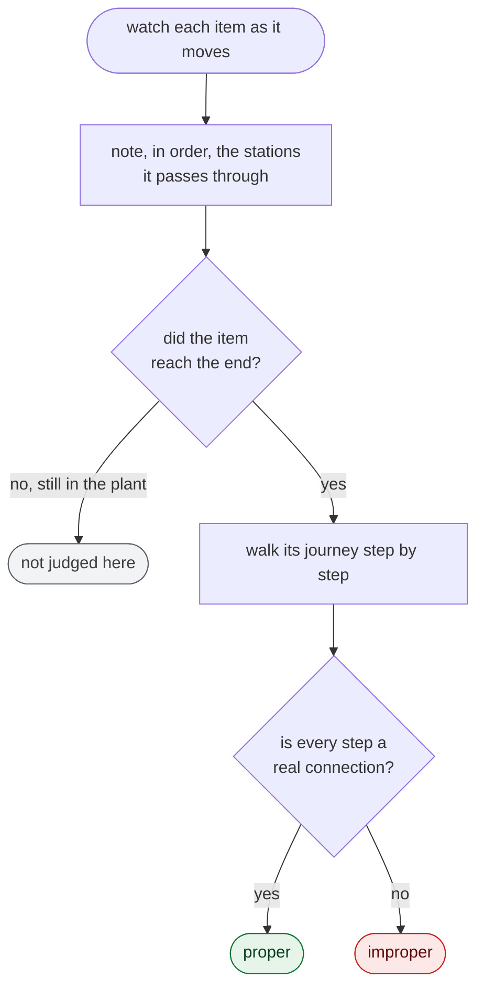

# Item-flow check

The conservation check asks whether any item went missing. This one asks a
different question about the items that **did** arrive: **did each one get there
by a proper route?** An item that reaches the end having followed a real path
through the plant *passes*. An item that reaches the end having somehow taken a
step the plant doesn't allow is an **alarm**.

We only judge the items we can prove arrived, which are the ones that reached the end of
the line. Items still stuck somewhere, still being worked on, or thrown away are
the conservation check's concern, not this one's.

## Flowchart

As the run unfolds, we watch each item and note, in order, the stations it passes
through — building up its journey. When an item reaches the end, we compare the
journey it took against the plant's connections.

## Why we judge only the arrivals

Tracking a journey means watching an item move from station to station. Once an
item reaches the end, its journey is complete and there is a whole path to judge.
An item that is still somewhere inside the plant has only a partial journey. A
"it hasn't finished yet" is not a fault, it is just unfinished. Whether such an
item is stuck or merely in progress is a question about *how many* items ended up
where, which is exactly what the conservation check answers. `validation_item_flow` judges the *shape* of a completed journey.

*The concept behind the `verify_item_flow` check in
`src/simgen/tools/validation.py`.*
