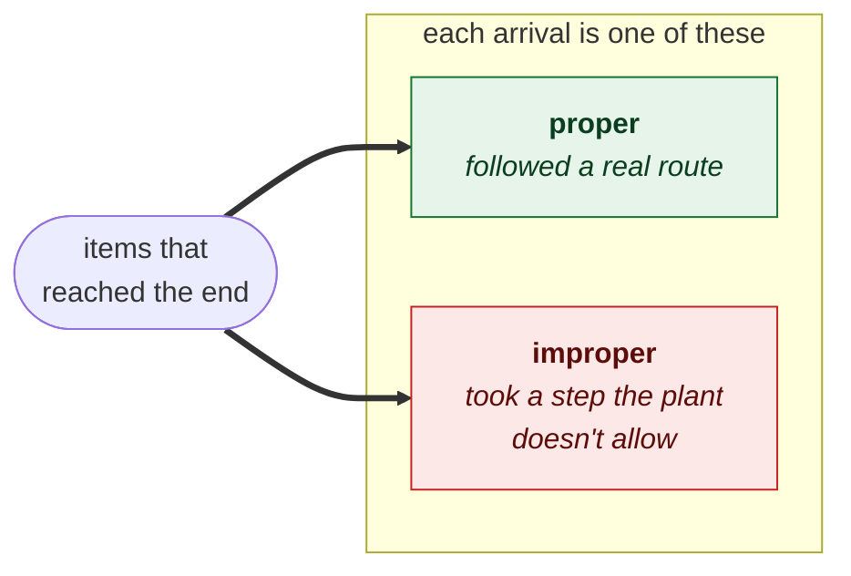
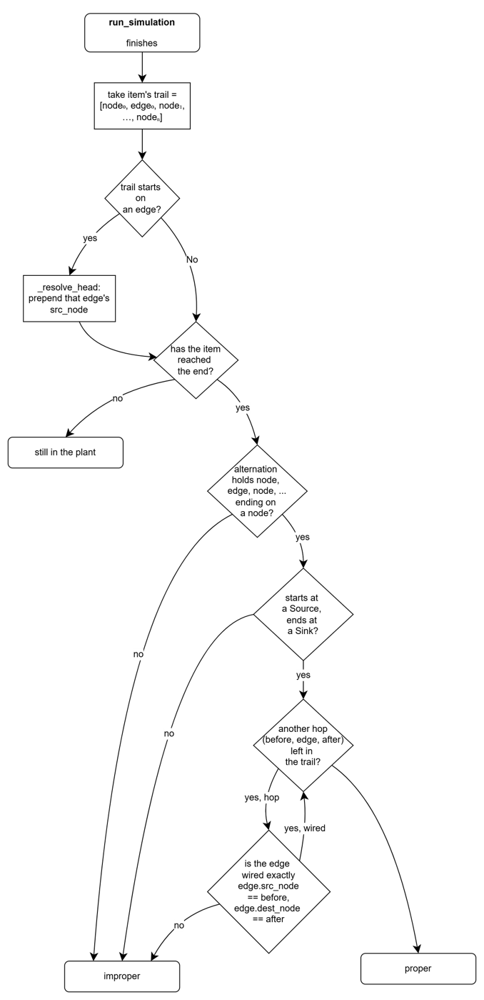

# Item-flow check

Every item that reached a Sink in the last run travelled some route, and this
check confirms it is a route the plant actually has. Each item's trail names the
stations it visited and the edge that carried it between each pair. A trail
*passes* when it runs from a Source to a Sink and every move in it was carried by
an edge wired exactly between the two stations it joins. A trail holding a move
no edge accounts for is an **alarm**, because the journey the run recorded
contradicts the plant as it was built.

We only judge the items we can prove arrived, which are the ones that reached the end of
the line. Items still stuck somewhere, still being worked on, or thrown away are
the conservation check's concern, not this one's.

```mermaid
flowchart LR
    made(["items that<br/>reached the end"])

    subgraph verdict["each arrival is one of these"]
        direction TB
        proper["<b>proper</b><br/><i>followed a real route</i>"]
        improper["<b>improper</b><br/><i>took a step the plant<br/>doesn't allow</i>"]
    end

    made ==> proper
    made ==> improper

    classDef good fill:#e6f4ea,stroke:#137333,color:#0b3d1f;
    classDef bad fill:#fce8e6,stroke:#c5221f,color:#5c0d0a;
    class proper good;
    class improper bad;
```

## Flowchart

During the run every hand-off is narrated into the event log. Afterwards,
`telemetry.build_item_paths` reads those events into `model.item_paths`: one
trail per item, alternating node and edge ids —
`["src", "B1", "M1", "B2", "M2", "B3", "snk"]` — so the trail names not only the
stations but the edge that carried each hop.

`verify_item_flow` then judges each trail in four steps:

1. **Head repair:** a non-blocking Source hands its first item over without
   naming itself, so that trail starts at an edge; `_resolve_head` prepends the
   edge's own `src_node`.
2. **Delivered filter:** only trails ending at a Sink are judged; the rest are
   in flight or discarded, which is `verify_conservation`'s concern.
3. **Shape:** even positions must be node ids, odd positions edge ids, and the
   trail must have odd length (end on a node). A trail that fails this is not
   readable as a journey at all: the fault is in the captured trail, not the
   routing.
4. **Route:** `trail[0]` must be a Source, `trail[-1]` a Sink, and every hop
   `(before, edge, after)` must satisfy `edge.src_node == before` and
   `edge.dest_node == after`, checked against the adjacency built from the live
   wiring.

A trail that clears all four counts toward `passed`; the first step that fails
puts it in `improper` as `{item, trail, at, reason}`, where `at` is the index of
the earliest fault and `reason` names what the wiring actually allows there.

## Why we judge only the arrivals

Tracking a journey means watching an item move from station to station. Once an
item reaches the end, its journey is complete and there is a whole path to judge.
An item that is still somewhere inside the plant has only a partial journey. A
"it hasn't finished yet" is not a fault, it is just unfinished. Whether such an
item is stuck or merely in progress is a question about *how many* items ended up
where, which is exactly what the conservation check answers. `validation_item_flow` judges the *shape* of a completed journey.

*The concept behind the `verify_item_flow` check in
`src/simtrace/tools/validation.py`.*
